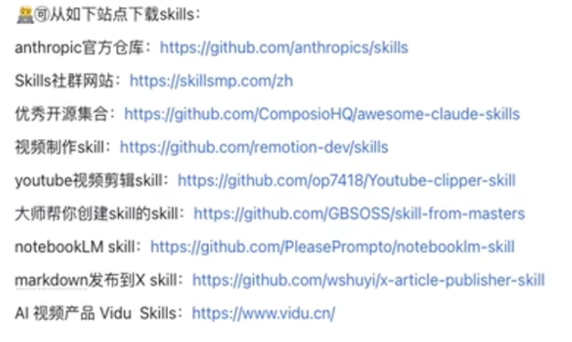

# Skill 集合总览

---

## 声明

本仓库所收录的 Skills 均收集自 **官方渠道** 或 **优秀的个人开发者/社区项目**，包括但不限于：

- **Anthropic 官方** — `anthropics-skills/`（Anthropic 发布的官方 Claude Skills，含完整 LICENSE.txt）
- **Awesome Claude Code 社区** — `awesome-claude-skills/`（社区贡献与维护的开源 Skills 集合）
- **Composio 官方** — `awesome-claude-skills/composio-skills/`（Composio 官方发布的 800+ 三方服务集成）
- **个人开源项目** — `Youtube-clipper-skill/`、`x-article-publisher-skill/`、`resume-skills/` 等来自开发者个人的优质创作

所有 Skills 均保留原始版权信息与许可证。详细来源与出处见 `img.png`。



## 目录

1. [目录结构概览](#1-目录结构概览)
2. [独立 Skills（顶级目录）](#2-独立-skills顶级目录)
3. [anthropics-skills（Anthropic 官方）](#3-anthropics-skillsanthropic-官方)
4. [awesome-claude-skills（社区合集）](#4-awesome-claude-skills社区合集)
   - [核心生产工具](#41-核心生产工具)
   - [设计/创意类](#42-设计创意类)
   - [文档处理](#43-文档处理)
   - [自动化/集成](#44-自动化集成)
   - [业务/营销类](#45-业务营销类)
   - [Composio 三方服务集成（839 个）](#46-composio-三方服务集成)
5. [skill-from-masters（技能创作方法论）](#5-skill-from-masters技能创作方法论)
6. [其他目录](#6-其他目录)
7. [附录：所有 Composio 集成列表](#7-附录所有-composio-集成列表)

---

## 1. 目录结构概览

```
skill/
├── Youtube-clipper-skill/         — YouTube 视频剪辑
├── anthropics-skills/             — Anthropic 官方技能集（18个）
├── awesome-claude-skills/         — 社区技能合集（864个，含839个Composio集成）
├── notebooklm-skill/              — NotebookLM 方法论提取
├── resume-skills/                 — 简历大师
├── skill-from-masters/            — 从实战案例学习创建 skill
├── skills/                        — remotion 技能
└── x-article-publisher-skill/     — X/Twitter 文章发布
```

---

## 2. 独立 Skills（顶级目录）

### 2.1 youtube-clipper（11KB）
| 字段 | 内容 |
|------|------|
| **名称** | `youtube-clipper` |
| **描述** | YouTube 视频智能剪辑工具。下载视频和字幕，AI 分析生成精细章节，用户选择片段后自动剪辑、翻译字幕为中英双语、烧录字幕到视频，并生成总结文案 |
| **适用场景** | 视频剪辑、YouTube、字幕翻译、双语字幕、视频下载 |
| **指定模型** | claude-sonnet-4-5-20250514 |

### 2.2 x-article-publisher（19KB）
| 字段 | 内容 |
|------|------|
| **名称** | `x-article-publisher` |
| **描述** | 将 Markdown 文章发布到 X (Twitter) Articles 编辑器，支持封面图上传和格式自动转换 |
| **适用场景** | 发布到 X、Twitter 文章发布、X Premium 文章 |

### 2.3 resume-master（5KB）
| 字段 | 内容 |
|------|------|
| **名称** | `resume-master` |
| **描述** | 通过直接编写可编辑的 HTML 源文件来创建简历或根据 JD 量身定制，最终交付可打印 PDF |
| **特点** | 提供 5 套模板（清新蓝灰、沉稳双栏、极简纯白、极客风尚、典雅酒红），支持 HTML → PDF 渲染 |

### 2.4 notebooklm（10KB）
| 字段 | 内容 |
|------|------|
| **名称** | `notebooklm` |
| **描述** | NotebookLM 方法论提取 — 从文档或案例提取可行方法，生成可复用的 Skill |

### 2.5 remotion-best-practices（12KB）
| 字段 | 内容 |
|------|------|
| **名称** | `remotion-best-practices` |
| **描述** | Remotion 视频编程最佳实践（位于 `skills/skills/remotion/` 和 `easy-demo/.hermes/skill/remotion/` 两处） |

---

## 3. anthropics-skills（Anthropic 官方）

来源：Anthropic 官方发布的 Claude Code Skills，共 **18 个**，均含 LICENSE.txt。

| # | 名称 | 大小 | 描述 |
|---|------|------|------|
| 1 | **algorithmic-art** | 20KB | 使用 p5.js 创建算法艺术，含种子随机性和交互式参数探索（流场、粒子系统） |
| 2 | **brand-guidelines** | 2KB | 应用 Anthropic 官方品牌色和排版到任何 artifacts |
| 3 | **canvas-design** | 12KB | Canvas 设计指导 — 有意的视觉设计、排版和美学方向 |
| 4 | **claude-api** | 42KB | **最大文件** — Claude API 集成指导，涵盖 Messages API、工具使用、Streaming |
| 5 | **doc-coauthoring** | 16KB | 文档协作写作，支持多人协同编辑 |
| 6 | **docx** | 21KB | Word (.docx) 文档生成和编辑 |
| 7 | **frontend-design** | 8KB | UI 设计指导 — 有特色、不模板化的视觉设计 |
| 8 | **internal-comms** | 2KB | 内部沟通模板和最佳实践 |
| 9 | **mcp-builder** | 9KB | MCP (Model Context Protocol) 服务器开发指南，支持 Python (FastMCP) 和 Node/TypeScript |
| 10 | **pdf** | 8KB | PDF 文档生成和处理 |
| 11 | **pptx** | 9KB | PowerPoint 演示文稿生成 |
| 12 | **skill-creator** | 34KB | **核心元技能** — 创建、修改、优化 Skill，运行评估、基准测试 |
| 13 | **slack-gif-creator** | 8KB | Slack GIF 创建工具 |
| 14 | **theme-factory** | 3KB | 主题工厂 — 生成可复用的视觉主题 |
| 15 | **web-artifacts-builder** | 3KB | Web Artifacts 构建器（HTML/JS 原型） |
| 16 | **webapp-testing** | 4KB | 使用 Playwright 进行 Web 应用测试，支持截图和浏览器日志 |
| 17 | **xlsx** | 12KB | Excel 电子表格生成和处理 |
| 18 | **template-skill** | <1KB | Skill 模板（空壳示例） |

---

## 4. awesome-claude-skills（社区合集）

最大的集合，共 **864 个**技能，来自 Claude Code Awesome Skills 社区。分为几个子类别：

### 4.1 核心生产工具

| 名称 | 大小 | 描述 |
|------|------|------|
| **artifacts-builder** | 3KB | 使用 React/Tailwind/shadcn 构建复杂 HTML Artifacts |
| **skill-creator** | 12KB | 创建有效 Claude Skills 的指南 |
| **skill-share** | 3KB | Skill 分享和分发 |
| **template-skill** | <1KB | Skill 模板骨架 |
| **changelog-generator** | 3KB | 自动生成 Changelog |
| **file-organizer** | 12KB | 智能文件和文件夹整理、查重、清理 |
| **mcp-builder** | 14KB | MCP Server 开发指南 |
| **webapp-testing** | 4KB | 使用 Playwright 测试本地 Web 应用 |
| **langsmith-fetch** | 11KB | LangSmith 数据获取和分析 |
| **connect** | 4KB | 连接管理 |
| **connect-apps** | 2KB | 应用连接集成 |

### 4.2 设计/创意类

| 名称 | 大小 | 描述 |
|------|------|------|
| **brand-guidelines** | 2KB | Anthropic 品牌风格应用 |
| **canvas-design** | 12KB | Canvas 视觉设计指导 |
| **theme-factory** | 3KB | 视觉主题生成 |
| **image-enhancer** | 3KB | 图片增强和优化 |

### 4.3 文档处理

| 名称 | 大小 | 描述 |
|------|------|------|
| **pdf** | 7KB | PDF 文档处理 |
| **docx** | 10KB | Word 文档处理 |
| **pptx** | 26KB | PowerPoint 演示文稿（最大之一） |
| **xlsx** | 11KB | Excel 电子表格处理 |

### 4.4 自动化/集成

| 名称 | 大小 | 描述 |
|------|------|------|
| **slack-gif-creator** | 18KB | Slack GIF 创建和分享 |
| **internal-comms** | 2KB | 内部沟通自动化 |
| **video-downloader** | 3KB | 视频下载工具 |
| **twitter-algorithm-optimizer** | 13KB | Twitter 算法优化 |

### 4.5 业务/营销类

| 名称 | 大小 | 描述 |
|------|------|------|
| **content-research-writer** | 15KB | 内容研究与写作助手 |
| **tailored-resume-generator** | 13KB | 根据 JD 定制简历 |
| **competitive-ads-extractor** | 8KB | 竞品广告提取分析 |
| **developer-growth-analysis** | 16KB | 开发者成长分析 |
| **domain-name-brainstormer** | 6KB | 域名头脑风暴 |
| **invoice-organizer** | 12KB | 发票整理和管理 |
| **lead-research-assistant** | 7KB | 潜在客户研究助手 |
| **meeting-insights-analyzer** | 11KB | 会议洞察分析 |
| **raffle-winner-picker** | 4KB | 抽奖工具 |

### 4.6 Composio 三方服务集成

**共 839 个**自动生成的 Composio 集成 Skill，统一模板（~3KB 每个），结构为：

```yaml
name: <service>-automation
description: |
  Triggered when user wants to use <service> integration...
instructions: |
  Use `composio add <service>` → `composio enable` → use tools
```

涵盖范围极其广泛，包括但不限于：

| 类别 | 示例 |
|------|------|
| **AI/LLM** | openai, replicate, perplexityai, mistral-ai, openrouter |
| **云服务** | cloudflare, digital-ocean, docker-hub, snowflake, neon |
| **CRM/销售** | salesforce, hubspot, attio, pipedrive, zoho |
| **沟通** | slack, discord, webex, twilio |
| **财务** | quickbooks, xero, stripe, braintree, ramp |
| **电商** | shopify, amazon, bigcommerce, bestbuy |
| **社交媒体** | twitter, linkedin, facebook, instagram, tiktok |
| **开发工具** | github, gitlab, bitbucket, linear, jira |
| **数据/分析** | google-analytics, mixpanel, amplitude, semrush |
| **人力资源** | workday, breezy-hr, smartrecruiters, sap-successfactors |
| **邮件/营销** | mailchimp, sendgrid, resend, benchmark-email |
| **内容管理** | wordpress, contentful, webflow, prismic |
| **文档/签名** | docusign, pandadoc, pdfmonkey, docuseal |
| **媒体** | spotify, twitch, vimeo, pexels |
| **地图/位置** | google-maps, mapbox, opencage, tomtom |
| **搜索引擎** | google-search, serpapi, serpdog, tavily |
| **安全** | virustotal, bitwarden, auth0, wiz |
| **区块链** | coinbase, coinmarketcap, alchemy, polygon |

> 注：所有 Composio Skills 均需执行 `composio add <service>` → `composio enable` 流程使用。

---

## 5. skill-from-masters（技能创作方法论）

| 名称 | 大小 | 描述 |
|------|------|------|
| **skill-from-masters** | 10KB | **核心元技能** — 从真实案例创建高质量 Skill。先找"黄金案例"和"失败案例"，归纳有效/无效模式，再用理论解释原因。核心理念：**Skill 是干活的，要从实践中学习，不是从书本中学习** |
| **skill-from-github** | 5KB | 从高质量 GitHub 项目学习并创建 Skill |
| **skill-from-notebook** | 9KB | 从文档/文章/视频中提取方法论，创建可执行的 Skill |
| **search-skill** | 5KB | 搜索和推荐来自可信市场的 Skills |

---

## 6. 其他目录

### 6.1 easy-demo（本地演示）
| 名称 | 大小 | 描述 |
|------|------|------|
| **frontend-design** | 8KB | (同 anthropics/frontend-design) 前端设计指导 |
| **remotion** | 12KB | Remotion 视频编程最佳实践 |
| **skill-creator** | 34KB | (同 anthropics/skill-creator) 创建和优化 Skill |

### 6.2 resume-skills
| 名称 | 大小 | 描述 |
|------|------|------|
| **resume-master** | 5KB | 简历 HTML 编写 + PDF 导出，5套模板 |

---

## 7. 附录：所有 Composio 集成列表

按字母顺序排列的 839 个 Composio 集成 Skill：

### A
-21risk-automation, -2chat-automation, ably-automation, abstract-automation, abuselpdb-automation, abyssale-automation, accelo-automation, accredible-certificates-automation, acculynx-automation, active-campaign-automation, addresszen-automation, adobe-automation, adrapid-automation, adyntel-automation, aero-workflow-automation, aeroleads-automation, affinda-automation, affinity-automation, agencyzoom-automation, agent-mail-automation, agentql-automation, agenty-automation, agiled-automation, agility-cms-automation, ahrefs-automation, ai-ml-api-automation, aivoov-automation, alchemy-automation, algodocs-automation, algolia-automation, all-images-ai-automation, alpha-vantage-automation, altoviz-automation, alttext-ai-automation, amara-automation, amazon-automation, ambee-automation, ambient-weather-automation, amcards-automation, anchor-browser-automation, anonyflow-automation, anthropic-administrator-automation, anthropic_administrator-automation, apaleo-automation, apex27-automation, api-bible-automation, api-labz-automation, api-ninjas-automation, api-sports-automation, api2pdf-automation, apiflash-automation, apify-automation, apilio-automation, apipie-ai-automation, apitemplate-io-automation, apiverve-automation, apollo-automation, appcircle-automation, appdrag-automation, appointo-automation, appsflyer-automation, appveyor-automation, aryn-automation, ascora-automation, ashby-automation, asin-data-api-automation, astica-ai-automation, async-interview-automation, atlassian-automation, attio-automation, auth0-automation, autobound-automation, autom-automation, axonaut-automation, ayrshare-automation

### B
backendless-automation, bannerbear-automation, bart-automation, baselinker-automation, baserow-automation, basin-automation, battlenet-automation, beaconchain-automation, beaconstac-automation, beamer-automation, beeminder-automation, bench-automation, benchmark-email-automation, benzinga-automation, bestbuy-automation, better-proposals-automation, better-stack-automation, bidsketch-automation, big-data-cloud-automation, bigmailer-automation, bigml-automation, bigpicture-io-automation, bitquery-automation, bitwarden-automation, blackbaud-automation, blackboard-automation, blocknative-automation, boldsign-automation, bolna-automation, boloforms-automation, bolt-iot-automation, bonsai-automation, bookingmood-automation, booqable-automation, borneo-automation, botbaba-automation, botpress-automation, botsonic-automation, botstar-automation, bouncer-automation, boxhero-automation, braintree-automation, brandfetch-automation, breeze-automation, breezy-hr-automation, brex-automation, brex-staging-automation, brightdata-automation, brightpearl-automation, brilliant-directories-automation, browseai-automation, browser-tool-automation, browserbase-tool-automation, browserhub-automation, browserless-automation, btcpay-server-automation, bubble-automation, bugbug-automation, bugherd-automation, bugsnag-automation, buildkite-automation, builtwith-automation, bunnycdn-automation, byteforms-automation

### C
cabinpanda-automation, cal-automation, calendarhero-automation, callerapi-automation, callingly-automation, callpage-automation, campaign-cleaner-automation, campayn-automation, canny-automation, canvas-automation, capsule-crm-automation, capsule_crm-automation, carbone-automation, cardly-automation, castingwords-automation, cats-automation, cdr-platform-automation, census-bureau-automation, centralstationcrm-automation, certifier-automation, chaser-automation, chatbotkit-automation, chatfai-automation, chatwork-automation, chmeetings-automation, cincopa-automation, claid-ai-automation, classmarker-automation, clearout-automation, clickmeeting-automation, clockify-automation, cloudcart-automation, cloudconvert-automation, cloudflare-api-key-automation, cloudflare-automation, cloudflare-browser-rendering-automation, cloudinary-automation, cloudlayer-automation, cloudpress-automation, coassemble-automation, codacy-automation, codeinterpreter-automation, codereadr-automation, coinbase-automation, coinmarketcal-automation, coinmarketcap-automation, coinranking-automation, college-football-data-automation, composio-automation, composio-search-automation, connecteam-automation, contentful-automation, contentful-graphql-automation, control-d-automation, conversion-tools-automation, convertapi-automation, conveyor-automation, convolo-ai-automation, corrently-automation, countdown-api-automation, coupa-automation, craftmypdf-automation, crowdin-automation, crustdata-automation, cults-automation, curated-automation, currents-api-automation, customerio-automation, customgpt-automation, customjs-automation, cutt-ly-automation

### D
d2lbrightspace-automation, dadata-ru-automation, daffy-automation, dailybot-automation, datagma-automation, datarobot-automation, deadline-funnel-automation, deel-automation, deepgram-automation, demio-automation, desktime-automation, detrack-automation, dialmycalls-automation, dialpad-automation, dictionary-api-automation, diffbot-automation, digicert-automation, digital-ocean-automation, discordbot-automation, dnsfilter-automation, dock-certs-automation, docker-hub-automation, docker_hub-automation, docmosis-automation, docnify-automation, docsbot-ai-automation, docsumo-automation, docugenerate-automation, documenso-automation, documint-automation, docupilot-automation, docupost-automation, docuseal-automation, doppler-marketing-automation-automation, doppler-secretops-automation, dotsimple-automation, dovetail-automation, dpd2-automation, draftable-automation, dreamstudio-automation, drip-jobs-automation, dripcel-automation

... 及更多（E-Z 共 839 个集成）

---

## 统计摘要

| 指标 | 数值 |
|------|------|
| **SKILL.md 总数** | **894** |
| - 独立顶级 Skills | 6 |
| - anthropics-skills | 18 |
| - awesome-claude-skills (非 Composio) | 25 |
| - Composio 三方集成 | 839 |
| - skill-from-masters | 4 |
| - 其他 | 2 |
| **最大文件** | claude-api (42KB) |
| **最小非空文件** | template-skill (146B) |
| **来源** | Anthropic 官方 + Awesome Claude Code + 自制 |

---

